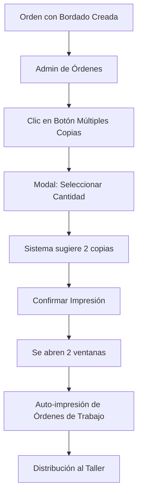

# Funcionalidad de Múltiples Copias - Orden de Trabajo

## Descripción

Se ha implementado una nueva funcionalidad que permite imprimir múltiples copias de **solo la orden de trabajo** (sin el ticket de venta). Esta característica es especialmente útil cuando:

- Las órdenes incluyen bordado y necesitas una copia para el taller y otra como respaldo
- Hay múltiples prendas en una orden que necesitan ser procesadas por diferentes trabajadores
- Necesitas distribuir copias entre diferentes departamentos (producción, bordado, control de calidad)

## ¿Qué Imprime?

### ✅ SÍ incluye:
- **Orden de trabajo únicamente**
- Número de orden
- Fecha y cliente
- Detalles de las prendas (nombre, SKU, talla, color, cantidad)
- Instrucciones de bordado (si las hay)
- Información de la escuela (si aplica)

### ❌ NO incluye:
- Ticket de venta del cliente
- Información de precios
- Métodos de pago
- Información de IVA o descuentos

## Ubicación de la Funcionalidad

### 1. En la Lista de Órdenes (`/admin/orders`)
- **Nuevo botón**: Junto al botón "Imprimir Recibo" encontrarás un botón con iconos de impresora y copia
- **Acceso rápido**: Permite imprimir múltiples órdenes de trabajo directamente desde la lista

### 2. En la Vista del Recibo (`/admin/orders/[id]`)
- **Botón principal**: "Imprimir Órdenes de Trabajo" en color naranja
- **Descripción clara**: "Imprime solo las órdenes de trabajo (sin ticket de venta) - ideal para el taller"

## Cómo Usar la Funcionalidad

### Paso 1: Activar el Modal
1. Haz clic en el botón de múltiples copias (iconos de impresora + copia o botón naranja)
2. Se abrirá un modal titulado "Imprimir Órdenes de Trabajo"

### Paso 2: Seleccionar Número de Copias
- **Controles**: Usa los botones + y - o escribe directamente el número
- **Límite**: Máximo 10 copias por impresión
- **Sugerencia automática**: Para órdenes con bordado, el sistema sugiere automáticamente 2 copias

### Paso 3: Confirmar Impresión
- **Visualización**: El botón muestra "Imprimir X orden(es) de trabajo"
- **Ejecución**: Al confirmar, se abren múltiples ventanas del navegador (una por copia)
- **Auto-impresión**: Cada ventana se imprimirá automáticamente después de cargar (1.5 segundos)

## Características Especiales

### Nueva Página Dedicada
- **Ruta**: `/admin/orders/[id]/work-order`
- **Propósito**: Muestra únicamente la orden de trabajo, sin elementos de venta
- **Optimizada**: Diseñada específicamente para impresión en papel de 48mm

### Detección Inteligente de Bordado
- **Reconocimiento automático**: El sistema detecta si una orden tiene notas de bordado
- **Sugerencia contextual**: Muestra un mensaje recomendando imprimir múltiples copias
- **Valor predeterminado**: Inicia con 2 copias para órdenes con bordado

### Auto-impresión Inteligente
- **Parámetro especial**: `?autoprint=true` en la URL activa la impresión automática
- **Delay optimizado**: 1.5 segundos de espera para asegurar que la página carga completamente
- **Espaciado entre ventanas**: 1 segundo entre cada nueva ventana para evitar problemas

### Interfaz Mejorada
- **Título específico**: "Imprimir Órdenes de Trabajo" (no "Múltiples Copias")
- **Descripción clara**: Explica que solo se imprime la orden de trabajo
- **Colores distintivos**: Botón naranja en el recibo para diferenciarlo del botón normal

## Casos de Uso Recomendados

### Para Órdenes con Bordado
```
Copias recomendadas: 2-3
- 1 copia para el taller de bordado
- 1 copia para control de calidad del bordado
- 1 copia adicional para archivo del taller
```

### Para Órdenes de Uniformes Escolares
```
Copias recomendadas: 2
- 1 copia para el departamento de confección
- 1 copia para supervisión/coordinación
```

### Para Órdenes Complejas (Múltiples Prendas Diferentes)
```
Copias recomendadas: 3-4
- 1 copia por cada tipo de prenda o proceso
- 1 copia para coordinación general
```

## Flujo de Trabajo Optimizado



## Ventajas de la Implementación

1. **Separación clara**: Solo imprime lo que el taller necesita
2. **Eficiencia**: No desperdicias papel en información de ventas
3. **Múltiples copias**: Una acción, múltiples resultados
4. **Automatización**: Las ventanas se imprimen solas
5. **Optimización**: Página dedicada con estilos de impresión específicos
6. **Flexibilidad**: Desde 1 hasta 10 copias según necesidad

## Diferencias con el Sistema Anterior

### Antes:
- Imprimía recibo completo (ticket de venta + orden de trabajo)
- Una sola impresión por acción
- Información mixta (venta y producción)

### Ahora:
- Imprime **solo orden de trabajo**
- Múltiples copias en una sola acción
- Información específica para el taller
- Auto-impresión inteligente
- Página dedicada optimizada

## Notas Técnicas

- **Tecnología**: React Client Component con Supabase
- **Ruta nueva**: `/admin/orders/[id]/work-order`
- **Parámetros**: `?autoprint=true` para auto-impresión
- **Estilos**: CSS optimizado para papel de 48mm
- **Timing**: 1 segundo entre ventanas, 1.5 segundos antes de imprimir

Esta implementación resuelve específicamente el problema de imprimir solo las órdenes de trabajo múltiples veces, sin incluir información de venta innecesaria para el taller.
